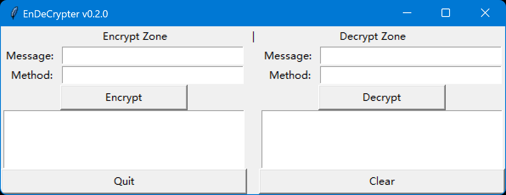
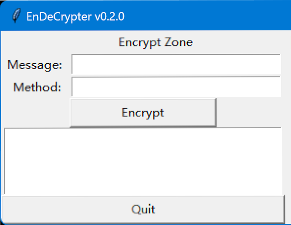

# Endecrypter v0.2.0

## 1. Licence

Copyright (c) 2025 zhilin.tang@qq.com. All rights reserved.Infringement will be prosecuted.

## 2. User Guide

### 2.1 Download

Go to "release" page to [get the last update](https://github.com/Lucas-Linlin/EnDeCrypter/releases) (EnDeCrypter.exe).

### 2.2 Application GUI

The ~~ugly ~~ GUI of the application will look like this:

There are 2 zones:

- Encrypt zone
- Decrypt zone

Each zone has 2 input boxes:

- Message
- Method

and a button to execute the encryption/decryption

and an output box to show the result.

At the bottom of the interface, there are 2 buttons:

- Quit (to exit the application)
- Clear (to clear the input & output boxes)

### 2.3 Encrypt
To encrypt a secret message, you need to input your message in the "Message" box:

Then, you need to customize a method to encrypt the message.
#### 2.3.1 Customize a method
A valid method is a string consisting solely of the letters a, b, and c (not necessarily all three letters, and upper/lower case is not distinguished).

There are some valid and invalid methods examples:
- "abc" is a valid method
- "ab" is a valid method
- "abcd" is an invalid method (includes invalid letter 'd')
- "123" is an invalid method (doesn't include letter 'a', 'b' or 'c', and includes invalid character '123')
- "abCbaABCABACac" is a valid method
- ...

If you don't know the meaning of letters a, b, and c, you can just consider the method as a password to encrypt/decrypt the message.

*And if you want to know the meaning, ~~go to watch the source code and study them~~ these are the implementation details.*