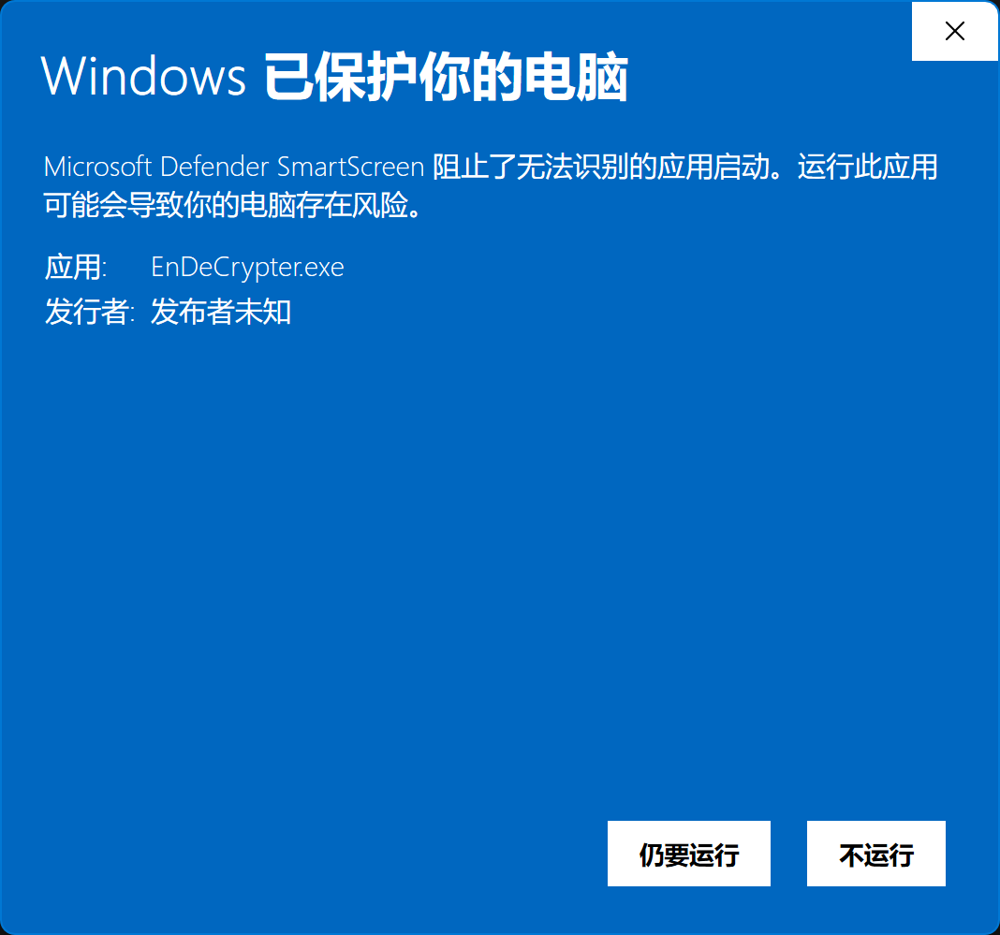
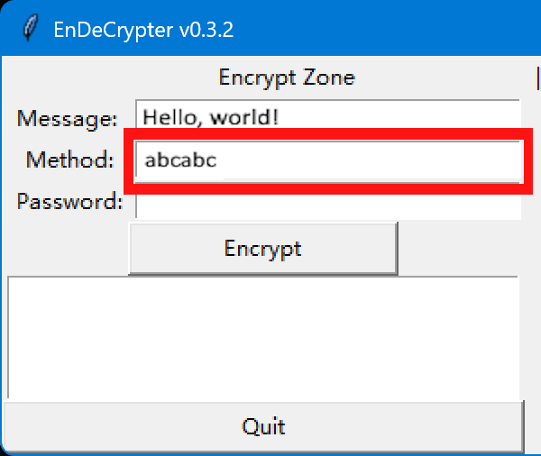
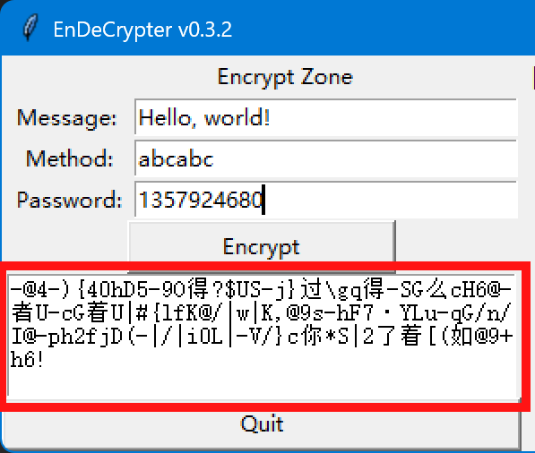

# Endecrypter v0.3.2 manual
## 1. Licence

Copyright (c) 2025 zhilin.tang@qq.com. All rights reserved. Infringement will be prosecuted.

## 2. User Guide

### 2.1 Download & Run

[Go to "release" page](https://github.com/Lucas-Linlin/EnDeCrypter/releases) and download `EnDeCrypter.exe` to get the last version.

Because there is no license for Windows at the moment, so Windows will prevent you from running the program when you double-click on it. Click on "Advanced Information" in the pop-up window and then "Still want to run".

### 2.2 Application GUI

The ~~ugly~~ GUI of the application will look like this:

There are 2 zones:

- `Encrypt zone`
- `Decrypt zone`

Each zone has 3 input boxes:

- `Message`
- `Method`
- `Password`

and a button to execute the encryption/decryption

and an output box to show the result.

At the bottom of the interface, there are 2 buttons:

- `Quit` (to exit the application)
- `Clear` (to clear the input & output boxes)

### 2.3 Encrypt
To encrypt a secret message, you need to input your __message__ in the `Message` box first:

Then, you need to customize a __method__ to encrypt the __message__.

#### 2.3.1 Customize a method
A valid __method__ is a string consisting solely of the letters `a`, `b`, and `c` (not necessarily all three letters, and __*upper case*__ and *__lower case__* are both OK).

There are some valid and invalid method examples:
- `abc` is a valid method
- `ab` is a valid method
- `abcd` is an invalid method (includes invalid letter 'd')
- `123` is an invalid method (doesn't include letter 'a', 'b' or 'c', and includes invalid characters '123')
- `abCbaABCABACac` is a valid method
- `abcabc1234qwabcabc` is an invalid method (includes invalid characters)
- ...

If you don't want to know the meaning of letters a, b, and c, you can just consider the method as the first password to encrypt/decrypt the message.

And then, input your __method__ to the `Method` box:

#### 2.3.2 Input a password
Unlike __method__, __Password__ is a positive integer.

There are some valid and invalid password examples:
- `102937613` is a valid password
- `99` is a valid password
- `-2813271` is an invalid password (negative number)
- `123.34` is an invalid password (float number)
- `123456789` is a valid password
- `123456abc789` is an invalid password (includes invalid characters)
- ...

Then input your __Password__ to the `Password` box:

#### 2.3.3 Done

When all above are inited, you can click the `Encrypt` button to encrypt your secret message.

The result will be show in the left output box:

**Copy and send it to your friend!**

### 2.4 Decrypt

Decrypt a __Message__ is like encrypt a __Message__.

You just need to input the __Message__, __Method__ and __Password__ from your friend to the box, and click the `Decrypt` button to see the answer.

Because of the algorithm, **Wrong Message, Method or Password** cannot be decrypted.