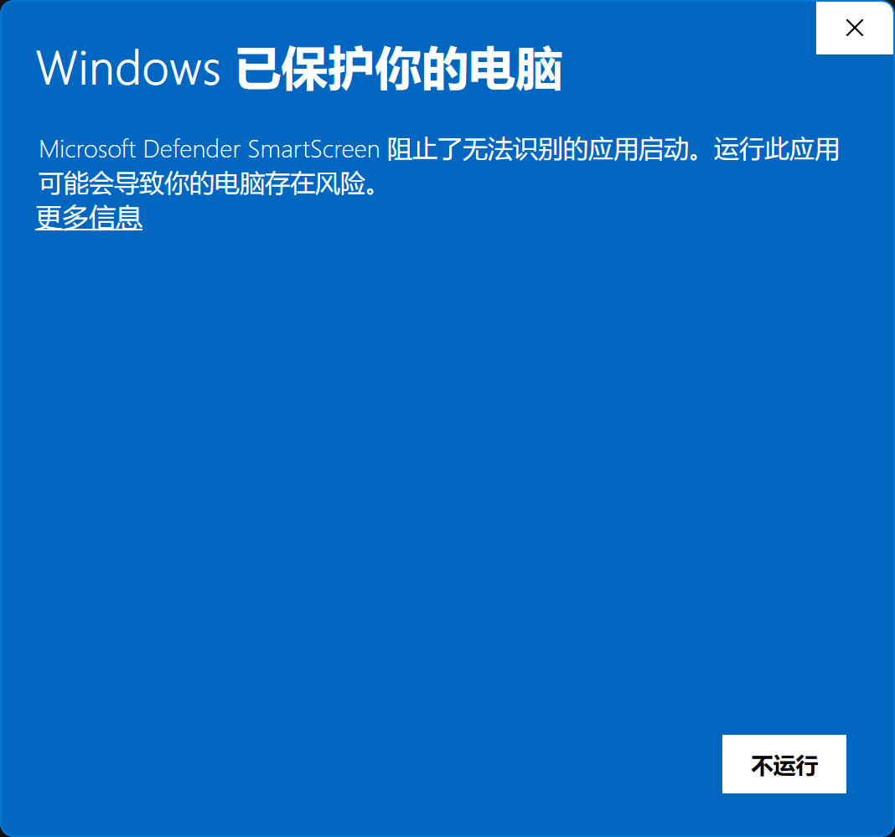
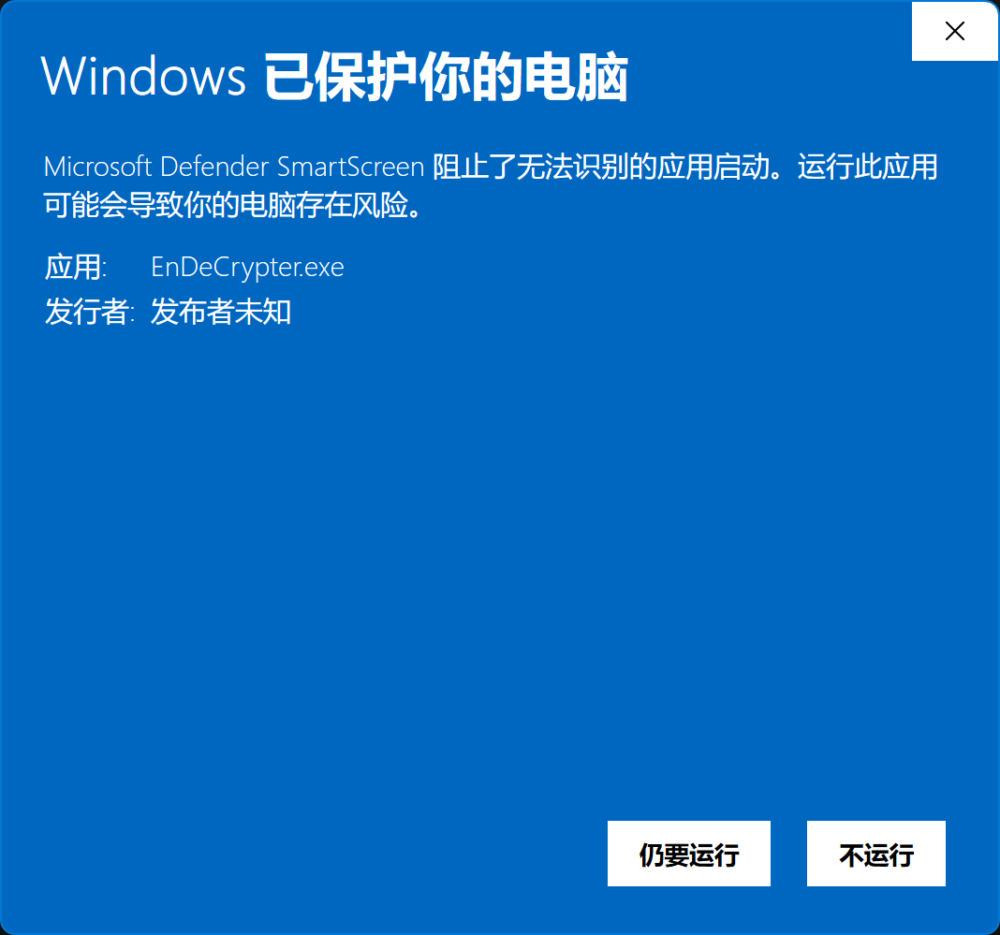
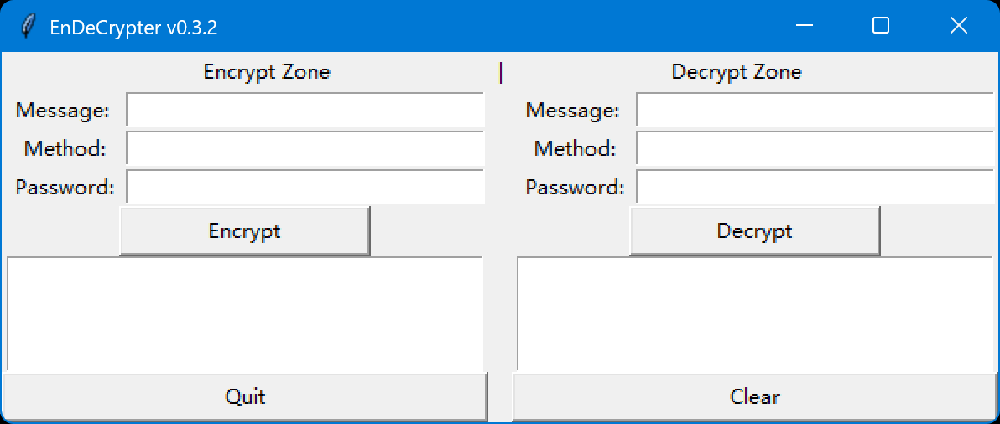
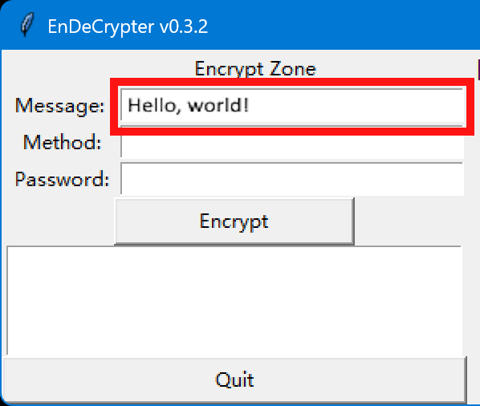
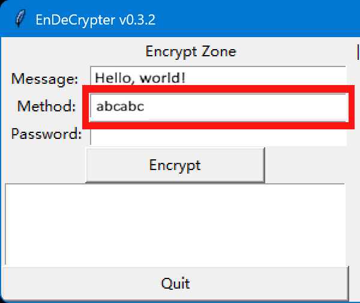
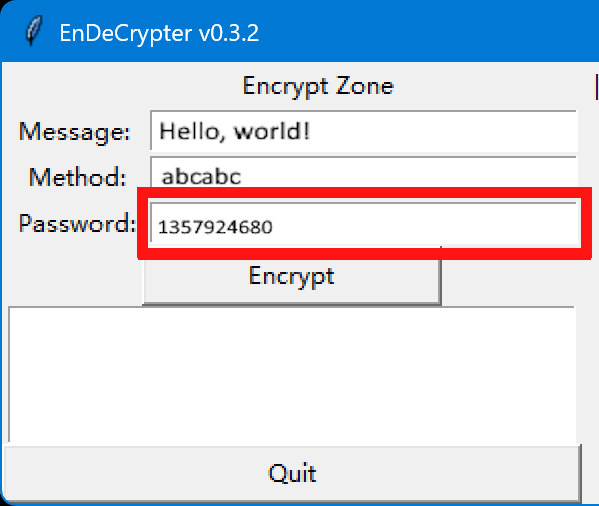
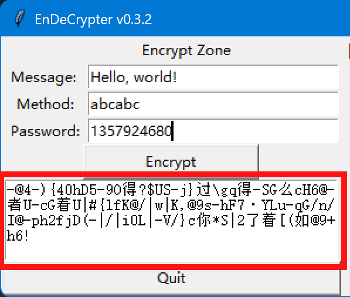

# 加解密器 v0.3.2 用户手册
## 1. 版权信息

版权所有 (c) 2025 zhilin.tang@qq.com. 保留所有权利。侵权必究。

## 2. 使用指南

### 2.1 下载与运行
[转到 "release" 页面](https://github.com/Lucas-Linlin/EnDeCrypter/releases) 并下载最新版本的 `EnDeCrypter.exe`。

由于此软件暂未获得Windows安全签名，所以Windows可能会阻止您运行此软件。双击下载后的文件，点击弹出窗口中的“更多信息”，再点击“仍要运行”即可。

### 2.2 用户界面

应用程序~~丑陋的~~图形用户界面看起来像这样：

窗口由两部分组成：

- `Encrypt Zone`（加密区）
- `Decrypt Zone`（解密区）

每个区域有3个输入框：

- `Message`（秘密消息）
- `Method`（方法）
- `Password`（密码）

和一个用于执行加密/解密操作的按钮，

和一个显示结果的输出文本框。

在界面的底部有两个按钮：

- `Quit`（退出）
- `Clear`（清空）

### 2.3 加密
加密需要用到`Encrypt Zone`中的3个输入框、1个按钮和1个输出框。

首先，将您的 __秘密消息__ 输入`Message`输入框中：

然后，您需要自定义一个 __方法__ 来加密 __秘密消息__。

#### 2.3.1 自定义一个方法
一个合法的 __方法__ 是一个仅包含字母`a`、`b`和`c`的字符串（不必须全部包含，且忽略大小写）。

下面是一些合法及非法的 __方法__ 示例。：
- `abc`是一个合法的方法
- `ab`也是一个合法的方法
- `abcd`是一个非法的方法（包含非法字符 “d”）
- `123`是一个非法的方法（不包含“a”、“b”或“c”中的任意一个，且包含非法字符“1”、“2”和“3”）
- `abCbaABCABACac`是一个合法的方法
- `abcabc1234qwabcabc`是一个非法的方法（包含非法字符）
- ...

__※警告：过长的方法可能会耗费大量内存。__

然后，把您的 __方法__ 输入到`Method`输入框中：

#### 2.3.2 输入密码
不同于 __方法__，__密码__ 是一个正整数。

下面是一些合法及非法的 __密码__ 示例：
- `102937613`是一个合法的密码
- `99`也是一个合法的密码
- `-2813271`是非法的密码（为负数）
- `123.34`是非法的密码（为浮点数）
- `12345678909876543212345678`是一个合法的密码
- `123456abc789`是非法的密码（不是数字）
- ...

接下来，把您的 __密码__ 输入到`Password`输入框中：

#### 2.3.3 完成！

当一切就绪，您就可以点击`Encrypt`按钮来加密信息了。

加密结果会显示在下面的输出框中：

**拷贝它并发送给您的朋友！**

### 2.4 解密

解密一条 __秘密信息__ 的方法与加密一条 __秘密信息__ 类似。

您仅需把来自您的朋友的 __秘密信息__，__方法__ 和 __密码__ 输入到`Decrypt Zone`对应的输入框中。点击`Decrypt`按钮来查看解密后的结果。

得益于强大的算法，密码与方法被嵌入于秘密消息中，所以**错误的秘密消息、方法或密码**中的任意一个均无法得出原始信息。